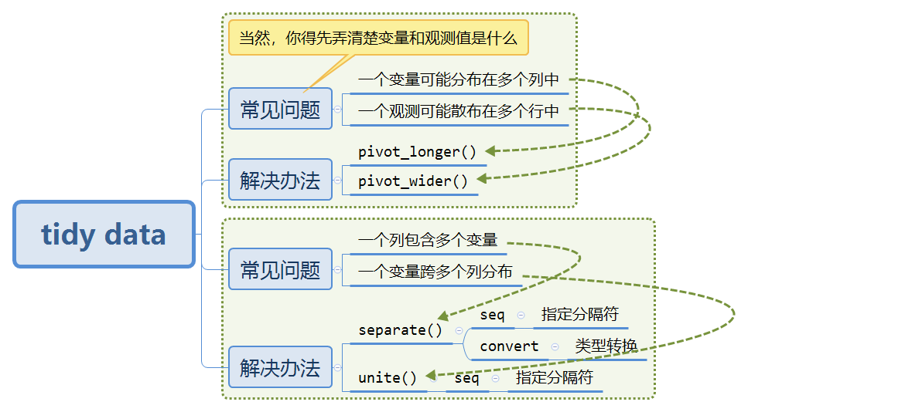

# Tidy data

学习`tidyr`包，用于整理（整齐）数据。
```{r}
library(tidyverse)
```


## 整齐的数据

想要整理数据，就得先知道我们的目标，即所谓**“整齐的数据（tidy data）”**指的是怎样的数据。

类似于数据库关系数据理论的1NF，整齐的数据需满足：

1. 每个变量必须有自己的列

2. 每个观察值必须有自己的一行

3. 每个值都必须有自己的单元格

在我们`tidyverse`的工具下，应当做到：

1. 将每个数据集放在一个tibble中

2. 将每个变量放在一列中

整齐数据的优势主要有两个：**得到一致性的数据结构**、**使R的矢量化运算发挥作用**。

## 数据的常见问题与整理方法

```{r echo=FALSE}

```


## 缺失值

一个值可能会以两种方式丢失：显示与隐式。

> An explicit missing value is the presence of an absence; an implicit missing value is the absence of a presence.

处理缺失值的几种方法：

- 不同的数据表示使隐式缺失值值显式化，或者可以设置隐式转换显式缺失值

- 显式显示缺失值：`complete()`

- `fill()`：将缺失值替换为最近的非缺失值

## 练习

（1）What would happen if you widen this table? Why? How could you add a new column to uniquely identify each value?
```{r}
people <- tribble(
  ~name, ~key, ~value,
  #-----------------|--------|------
  "Phillip Woods",  "age", 45,
  "Phillip Woods", "height", 186,
  "Phillip Woods", "age", 50,
  "Jessica Cordero", "age", 37,
  "Jessica Cordero", "height", 156
)

# name与key不能确定value
people %>% 
  pivot_wider(names_from="key",values_from = "value")

# 添加新列
people %>% 
  group_by(name,key) %>% 
  mutate(no = row_number()) %>% 
  pivot_wider(names_from = "name",values_from="value")
```

（2）Tidy the simple tibble below. Do you need to make it wider or longer? What are the variables?
```{r}
preg <- tribble(
  ~pregnant, ~male, ~female,
  "yes",     NA,    10,
  "no",      20,    12
)

# longer
preg %>% 
  pivot_longer(cols = c("male","female"),
               names_to = "sex",
               values_drop_na=T) %>%   # 去缺失值（怀孕，男）
  mutate(
    female = (sex=="female"),
    pregnant = (pregnant=="yes")  # 受启发，改为逻辑变量
  ) %>% 
  select(female,pregnant,value)


```


