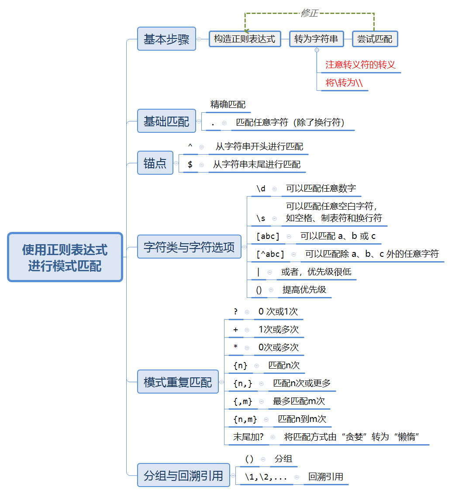
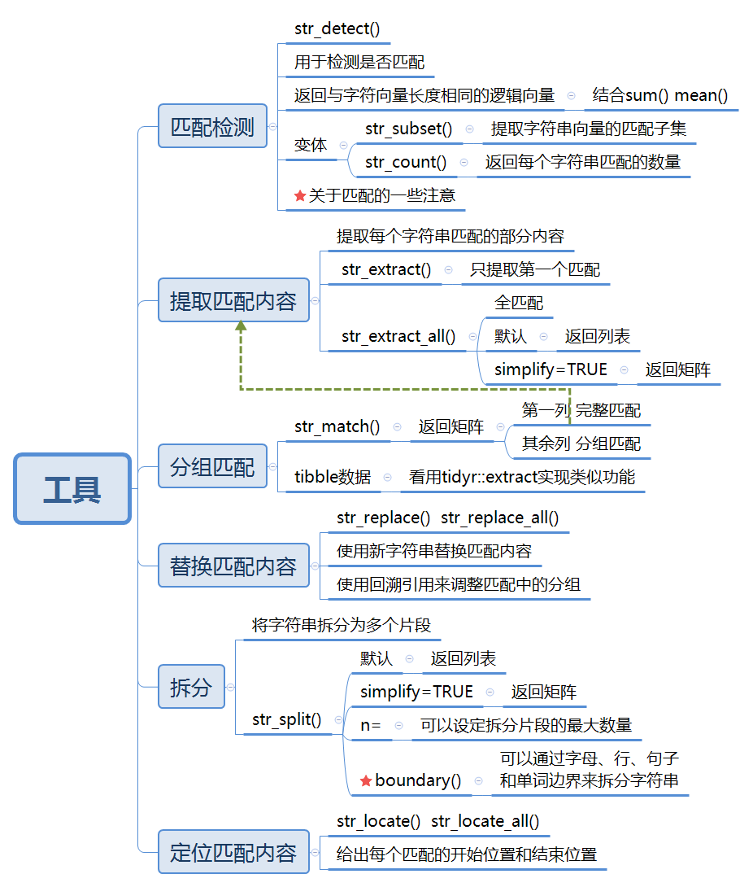

# Strings

学习`stringr`包去处理字符串，主要内容是正则表达式。
```{r}
library(tidyverse)
```

## 字符串基础

```{r echo=FALSE}
knitr::include_graphics("images/strings-字符串基础.png")
```

关于丢弃长度为0的对象，稍微修改了一下原书的例子：
```{r}
name <- "Hadley" 
time_of_day <- "morning" 
birthday <- FALSE 
 
str_c( 
  "Good ", time_of_day, " ", name, 
  if (birthday) " and HAPPY BIRTHDAY" else "..",  # 注意这里
  "." 
) 
```

结合`if`语句使用非常好用。

## 使用正则表达式进行模式匹配

可以通过`str_view()`和`str_view_all()`函数来学习正则表达式

正则表达式的内容很多，下面只是简单把书上提高的内容列举一下：
```{r echo=FALSE}

```

### 练习

#### 基础匹配

（1）解释一下为什么这些字符串不能匹配一个反斜杠`\`：`"\"`、`"\\"`、`"\\\"`。

匹配一个反斜杠 `\` 的正则表达式为 `\\` ，再转为字符串自然是`"\\\\"`。

而
```{r eval=FALSE, error=TRUE}
# 这不是一个合法字符串，末尾缺一个"
writeLines("\")
```
```{r error=TRUE}
# 这个字符串实际上是\，不能匹配\
writeLines("\\")
```
```{r error=TRUE,eval=FALSE}
# 非法字符串
writeLines("\\\")
```

（2）如何匹配字符序列 `"'\` ？
```{r}
# 先确定正则表达式为 "'\\
# 再确定字符串为 \"\'\\\\
writeLines("\"\'\\\\")
# 最后验证一下
x <- "abc\"\'\\de"
writeLines(x)
str_view(x, "\"\'\\\\")
```

（3）正则表达式`\..\..\..`会匹配哪种模式？如何用字符串来表示这个正则表达式？

会匹配“.+任意字符+.+任意字符+.+任意字符”。
```{r}
# 字符串表达
x <- "\\..\\..\\.."
writeLines(x)
```

#### 锚点

（1）如何匹配字符串`"$^$"`？
```{r}
# 先确定正则表达式为 \$\^\$

# 再确定字符串
x <- "\\$\\^\\$"
writeLines(x)
# 尝试匹配
s <- "ab$^$cd"
writeLines(s)
str_view(s,x)
```

**更正：**之前没有考虑到全字匹配。
```{r}
# 先确定正则表达式为 ^\$\^\$$

# 再确定字符串
x <- "^\\$\\^\\$$"
writeLines(x)
# 尝试匹配
str_view(c("$^$", "ab$^$sfas"), "^\\$\\^\\$$", match = TRUE)
```


（2）给定`stringr::words`中的常用单词语料库，创建正则表达式以找出满足下列条件的所有单词。

```{r}
# 以 y 开头的单词
x <- "^y"
str_view(stringr::words,x,match = T)
```

```{r}
# 以 x 结尾的单词
x <- "x$"
str_view(stringr::words,x,match = T)
```

```{r}
#  长度正好为 3 个字符的单词。
x <- "^...$"
str_subset(stringr::words,x) 
```

```{r}
# 具有 7 个或更多字符的单词
x <- "^......."
str_subset(stringr::words,x)
```


#### 字符类与字符选项

（1）创建正则表达式来找出符合以下条件的所有单词。

```{r}
# 以元音字母开头的单词
x <- "^[aeiou]"
# str_view(stringr::words,x,match = T)
# 参考答案，结果太多，使用str_subset
str_subset(stringr::words,x)
```

```{r}
# 只包含辅音字母的单词
x <- "[aeiou]"
str_view(stringr::words,x,match = F) # match=F，只显示匹配不成功的单词
# 若使用str_subset，设置negate=TRUE
```

```{r}
# 以 ed 结尾，但不以 eed 结尾的单词
x <- "[^e]ed$"
str_view(stringr::words,x,match = T)

# ADD:上面不会匹配到字符串"ed"，需要手动加入
# x <- "(^|[^e])ed$"
```

```{r}
#  以 ing 或 ise 结尾的单词
x <- "ing|ise"  # 或者i(ng|se)
str_view(stringr::words,x,match = T)
```


（2）实际验证一下规则：i 总是在 e 前面，除非 i 前面有 c。

那就假设它们是挨在一起的了。
```{r}
# 要匹配不符合规则的字符串，比如
# [^c]ei,^ei
x <- "[^c]ei|^ei"
str_view(stringr::words,x,match = T)
```


（3）q 后面总是跟着一个 u 吗？

```{r}
x <- "q[^u]"
str_view(stringr::words,x,match = T)
```

在这个数据集中的确是这样子的。

#### 重复

（3）创建正则表达式来找出满足以下条件的所有单词。

```{r}
# 以 3 个辅音字母开头的单词
x <- "^[^aeiou]{3}"
str_subset(stringr::words,x)
```

```{r}
# 有连续 3 个或更多元音字母的单词
x <- "[aeiou]{3,}"
str_subset(stringr::words,x)
```

```{r}
#  有连续 2 个或更多元音—辅音配对的单词
x <- "([aeiou][^aeiou]){2,}"
str_subset(stringr::words,x)
```

#### 分组与回溯引用

（2）创建正则表达式来匹配出以下单词。

```{r}
# 开头字母和结尾字母相同的单词
x <- "^(.).*\\1$"
str_subset(stringr::words,x)

# 更正：忽略只有一个字母的字符串
x <- "^(.)((.*\\1$)|$)"
str_subset(stringr::words,x)
```

```{r}
# 包含一对重复字母的单词（例如，church 中包含了重复的 ch）。
# 严谨一点，用[A-Za-z]代替.
x <- "(..).*\\1"
str_subset(stringr::words,x)
```

```{r}
# 包含一个至少重复 3 次的字母的单词（例如，eleven 中的 e 重复了 3 次）
# 严谨一点，用[A-Za-z]代替.
x <- "(.).*\\1.*\\1"
str_subset(stringr::words,x)
```

## 工具

利用正则匹配来解决实际问题

### 导图

```{r}

```

### 关于匹配的一些注意

> 如果正则表达式过于复杂，则应该将其分解为几个更小的子表达式，将每个子表达式的匹配结果赋给一个变量，并使用逻辑运算组合起来。

> 匹配从来不会重叠。

> 很多`stringr`函数都是成对出现的：一个函数用于单个匹配，另一个函数用于全部匹配，后者会有后缀 `_all`。

### boundary()

`boundary()`可以通过字母(character)、行(line_break)、句子(sentence)和单词(word)边界来拆分字符串。

比如
```{r}
x <- "This is a sentence. This is another sentence." 
str_view_all(x, boundary("word"))
```

```{r}
str_split(x,boundary("word"))
```

#### 疑问
 
有一点不太明白，`boundary("word)`如果是用于匹配词，那么再使用`str_split`拆分，剩下的不应该是“非词”部分吗？比如是用空格拆分，返回非空格部分：
```{r}
str_split(x," ")
```

但你要说它不是匹配词，用`str_extract_all()`函数却可以得到拆分结果：
```{r}
str_extract_all(x,boundary("word"))
```

可能这个函数重载了？挖个坑...

 