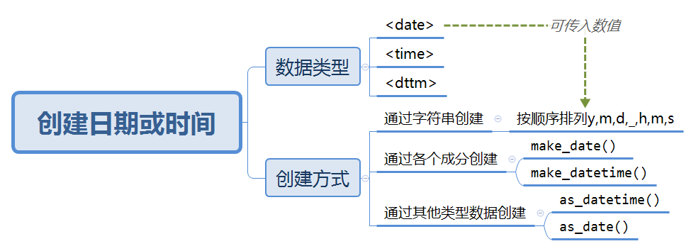
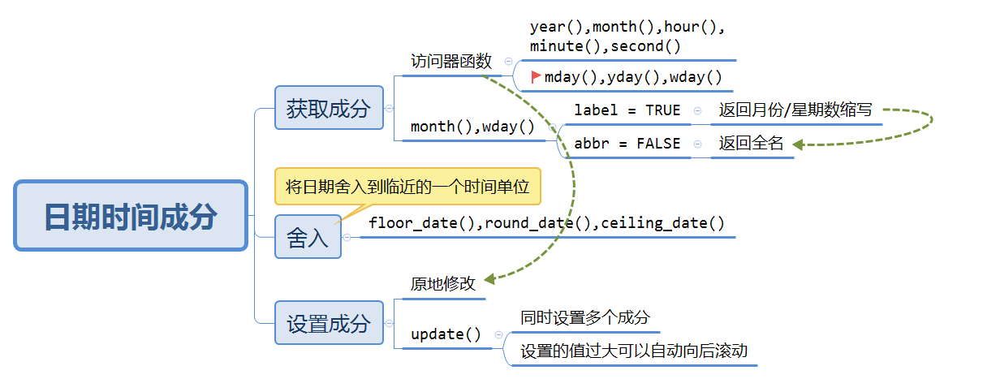
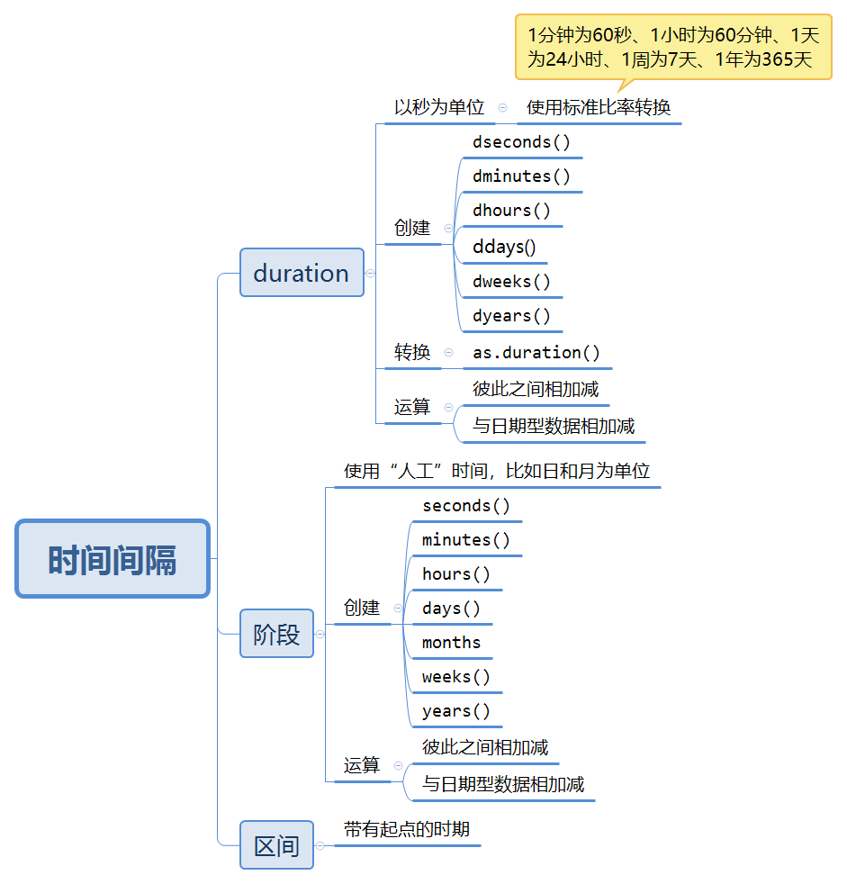

# Dates and times

本章主要学习使用`lubridate`处理日期时间类型的数据。

```{r include=FALSE}
library(tidyverse)
library(lubridate)
library(nycflights13)
```

## 创建日期或时间

### 导图
```{r echo=FALSE,out.width="80%"}

```

### 处理`flights`日期时间数据

```{r}
make_datetime_100 <- function(year, month, day, time) { 
  make_datetime(year, month, day, time %/% 100, time %% 100) 
} 
 
flights_dt <- flights %>% 
  filter(!is.na(dep_time), !is.na(arr_time)) %>% 
  mutate( 
    dep_time = make_datetime_100(year, month, day, dep_time), 
    arr_time = make_datetime_100(year, month, day, arr_time), 
    sched_dep_time = make_datetime_100( 
      year, month, day, sched_dep_time 
    ), 
    sched_arr_time = make_datetime_100( 
      year, month, day, sched_arr_time 
    ) 
  ) %>% 
  select(origin, dest, ends_with("delay"), ends_with("time")) 
 
flights_dt 
```

### 绘图

>注意，当将日期时间型数据作为数值使用时（比如在直方图中），1 表示 1 秒，因此分箱宽
度 86 400 才能够表示 1 天。对于日期型数据，1 则表示 1 天。

```{r}
flights_dt %>% 
  ggplot(aes(dep_time)) + 
  geom_freqpoly(binwidth = 86400) # 86400秒 = 1天
```


## 日期时间成分

### 导图

```{r echo=FALSE,out.width="80%"}

```

### 获取day成分

提供了三个访问器函数，`mday()`（一个月中的第几天）、`yday()`（一年中的第几天）、`wday()`（一周中的第几天）。


## 时间间隔

```{r echo=FALSE,out.width="80%"}

```

>如果只关心物理时间，那么就使用时期；如果还需要考虑人工时间，那么就使用阶段；如果需要找出人工时间范围内有多长的时间间隔，那么就使用区间。

## 时区

在R中，时区是日期时间型数据的一个属性，仅用于控制输出，不会影响具体的时刻。

改变时区的两种方法：

- 保持时间不变，修改其显示方式：`with_tz`

- 修改内部时间：`force_tz`

## 练习


