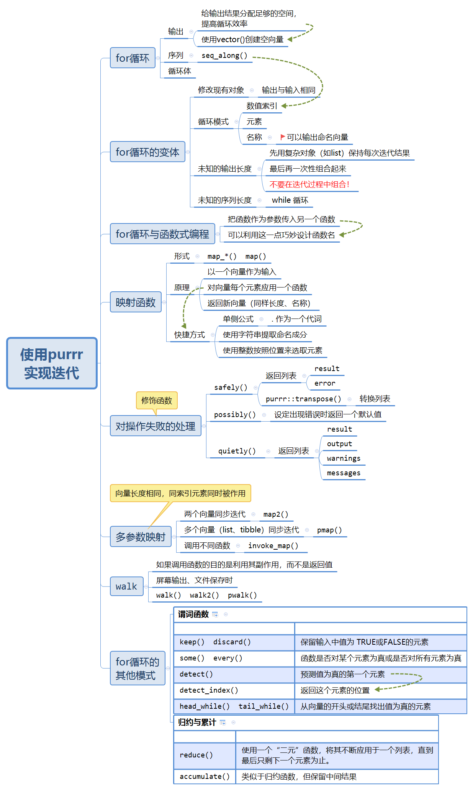

# Iteration

学习使用`purrr`实现迭代。
```{r message=FALSE,cache=FALSE}
library(tidyverse) 
library(microbenchmark)
```

## 一个很长的导图

```{r echo=FALSE,out.width="85%"}

```


## 导图补充

### 循环模式：名称

如果想要创建命名的输出向量，请一定按照如下方式进行命名：
```{r eval=FALSE}
results <- vector("list", length(x)) 
names(results) <- names(x)
```

## 练习

（1）It’s common to see for loops that don’t preallocate the output and instead increase the length of a vector at each step:
```{r eval=FALSE}
output <- vector("integer", 0)
for (i in seq_along(x)) {
  output <- c(output, lengths(x[[i]]))
}
output
```
How does this affect performance? Design and execute an experiment.


安装`microbenchmark`包，`microbenchmark`函数可以比较多个函数多次运行时间。

```{r}
# 未预先分配输出空间
add_vector_1 <- function(n){
  output <- vector("integer", 0) 
  for (i in seq_len(n)) { 
    output <- c(output, i) 
  output
  } 
}
# 预先分配输出空间
add_vector_2 <- function(n){
  output <- vector("integer", n) 
  for (i in seq_len(n)) { 
    output[[i]] <- i
  output
  } 
}

# 比较运行时间
 microbenchmark(add_vector_1(10000), add_vector_2(10000), times = 10)
```

差了两个数量级。

