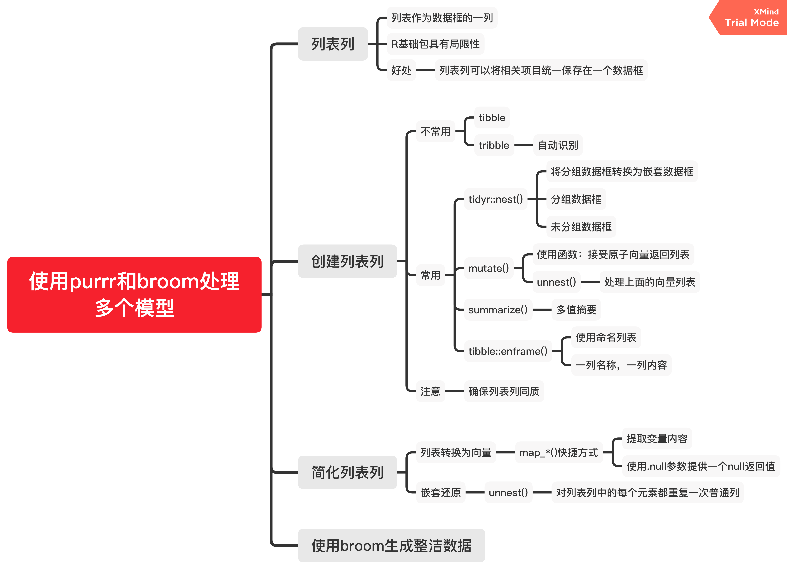

# Many models {#many-models}

```{r message=FALSE,cache=FALSE}
library(modelr)
library(tidyverse)
```

## gapminder 

对gapminder这个数据表进行分析一下。

```{r}
# 载入数据包
library(gapminder)
gapminder
```

### 初识数据
```{r}
str(gapminder)
```

```{r eval=FALSE}
?gapminder
```

数据包括各国预期寿命，人均GDP和人口数据的摘录。各个字段含义如下：

- country：国家。因子变量，142个水平。

- continent：国家所属大洲。因子变量，5个水平。

- year：年份。1952-2007，每5年一个记录。

- lifeExp：预期寿命。

- pop：人口数。

- gdpPercap：人均国内生产总值。


### 案例研究

问题：每个国家(country)的预期寿命(lifeExp)是如何随时间(year)变化的?

```{r}
gapminder %>% 
  ggplot(aes(year, lifeExp, group = country)) +
    geom_line(alpha = 1/3)
```

可以看到，总的来说，预期寿命似乎一直在稳步提高。然而，如果仔细观察，我们可能会注意到一些国家没有遵循这种模式。为了使这些国家更容易被看到，我们可以使用线性趋势拟合模型，解释模型随时间稳定的部分，再从残差中研究剩余的部分。

对于某一个国家，这样的工作并不困难。

```{r}
nz <- filter(gapminder, country == "China")
nz %>% 
  ggplot(aes(year, lifeExp)) + 
  geom_line() + 
  ggtitle("Full data = ")

nz_mod <- lm(lifeExp ~ year, data = nz)
nz %>% 
  add_predictions(nz_mod) %>%
  ggplot(aes(year, pred)) + 
  geom_line() + 
  ggtitle("Linear trend + ")

nz %>% 
  add_residuals(nz_mod) %>% 
  ggplot(aes(year, resid)) + 
  geom_hline(yintercept = 0, colour = "white", size = 3) + 
  geom_line() + 
  ggtitle("Remaining pattern")
```


对于多个国家，我们可以使用`purrr`的`map`函数，但我们需要先构建每个国家的嵌套数据框。
```{r}
by_country <- gapminder %>% 
  group_by(country, continent) %>% 
  nest()
head(by_country)
```

这是一个嵌套数据框，它的`data`列是一列数据框。

这时可以对每个国家拟合模型了：
```{r}
country_model <- function(df) {
  lm(lifeExp ~ year, data = df)
}
by_country <- by_country %>% 
  mutate(model = map(data, country_model))
```

再对于每个模型添加残差：
```{r}
by_country <- by_country %>% 
  mutate(
    resids = map2(data, model, add_residuals)
  )
by_country
```

 
嵌套数据框好处理，但要展示出来还得解除嵌套(unnest)：
```{r}
resids <- unnest(by_country, resids)
resids
```

绘制各个国家的年份-预期寿命残差图： 
```{r}
resids %>% 
  ggplot(aes(year, resid)) +
    geom_line(aes(group = country), alpha = 1 / 3) + 
    geom_smooth(se = FALSE)
```
 
或者对大洲进行分面绘制：
```{r}
resids %>% 
  ggplot(aes(year, resid, group = country)) +
    geom_line(alpha = 1 / 3) + 
    facet_wrap(~continent)
```

 
除了残差，还有很多指标可以衡量模型，可以使用`broom::glance()`去得到：
```{r}
glance <- by_country %>% 
  mutate(glance = map(model, broom::glance)) %>% 
  unnest(glance)
```
 
一般我们可以通过R平方去衡量模型解释的好坏，通过对R平方排序找出拟合不好的模型：
```{r}
glance %>% 
  arrange(r.squared)
```


一些比较差的模型似乎都在非洲：
```{r}
glance %>% 
  ggplot(aes(continent, r.squared)) + 
    geom_jitter(width = 0.5)  # 横向抖动0.5
```
 

或者我们可以把拟合效果最差的一些模型筛选出来，并绘制它们的年份-预期寿命图像：
```{r}
bad_fit <- filter(glance, r.squared < 0.25)

gapminder %>% 
  semi_join(bad_fit, by = "country") %>%   # 筛选连接，保留匹配
  ggplot(aes(year, lifeExp, colour = country)) +
    geom_line()
```

影响因素主要是艾滋病与种族灭绝。
 
## 思维导图

```{r echo=FALSE,out.width="85%"}

```


 
 
 
 

