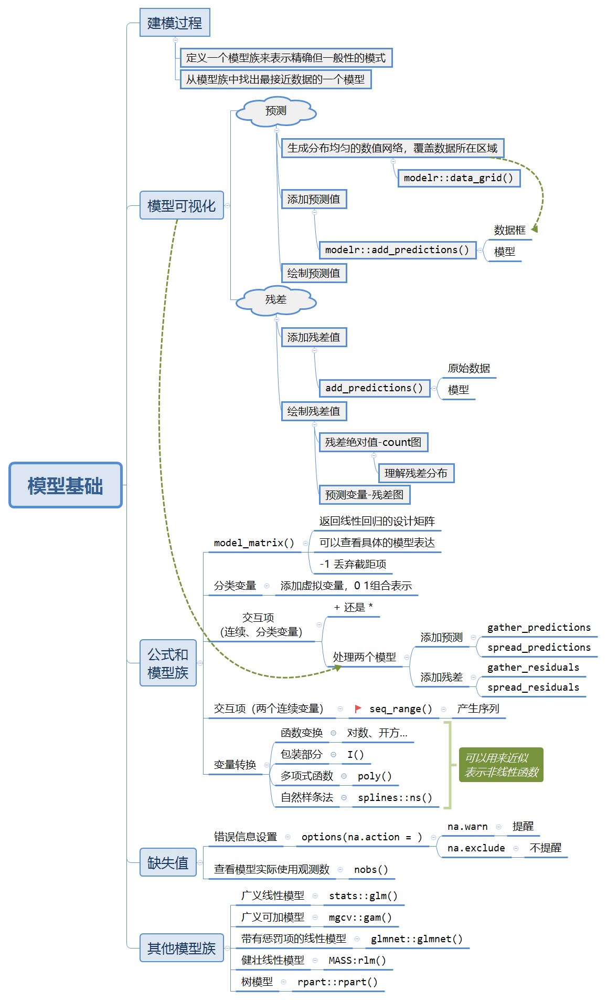

# model-basics

学习利用`modelr`进行基础的建模，主要是如何对一般性的模型进行可视化。
```{r message=FALSE,cache=FALSE}
library(tidyverse)

library(modelr)
options(na.action = na.warn)
```

## 思维导图
```{r echo=FALSE,out.width="85%"}

```


## 导图补充

`seq_rang()`函数的一些用法。

基本作用：生成序列用于覆盖某个向量。

```{r eval=FALSE}
seq_range(x, n, by, trim = NULL, expand = NULL, pretty = FALSE)
```

例如：
```{r}
x <- sim4$x1
seq_range(x,5)  # 生成长度为5的等间隔序列覆盖向量x
seq_range(x,by = 0.5) # 生成间隔为0.5的等间隔序列覆盖向量x
```

-  `pretty = TRUE` 会生成一个“漂亮的”序列。
```{r}
seq_range(c(0.0123, 0.923423), n = 5) 
seq_range(c(0.0123, 0.923423), n = 5, pretty = TRUE)
```

-  `trim = 0.1`会截断 10% 的尾部值

-  `expand = 0.1`可以将取值范围扩大 10%