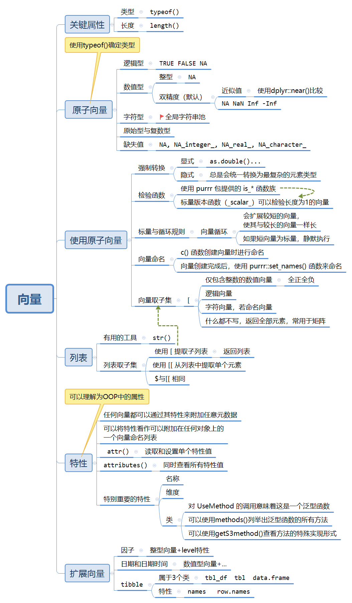

# Vectors

```{r message=FALSE,cache=FALSE}
library(tidyverse) 
```

## 一个很长的导图

```{r echo=FALSE,out.width="85%"}

```


## 导图补充

### 全局字符串池

> R使用的是全局字符串池。这意味着每个唯一的字符串在内存中只保存一次，每次对这个字符串的使用都指向这段内存，这样可以减少复制字符串所需的内存空间。

### 一些数值型特殊值的检查

```{r}
x <- c(1,NA,NaN,Inf,-Inf)
is.finite(x)
is.infinite(x)
is.na(x)  # 这个NA NaN都会返回True
is.nan(x)
```

## 练习

（1）对比`setNames()`与`purrr::set_names()`

用法上的略有不同暂不说，`purrr::set_names()`的主要特色在于

- 允许使用函数或者公式来转换现有名称：
```{r}
purrr::set_names(c(a = 1, b = 2, c = 3), toupper)
purrr::set_names(c(a = 1, b = 2, c = 3), ~toupper(.))
```

- `purrr::set_names()`要求命名向量与原向量长度相同，`setNames()`则不然：
```{r error=TRUE}
purrr::set_names(1:4, c("a", "b"))
setNames(1:4, c("a", "b"))
```

（2）在编写程序/函数时，需要考虑一些特殊值或者特殊情况，比如空向量、`Inf`、`-Inf`、`NA`、`NaN`等的处理。

（3）What happens if you subset a `tibble` as if you’re subsetting a list? What are the key differences between a list and a `tibble`?

`tibble`可以看作是列的列表，只不过每列的长度必须相同，这是与列表最大的不同。在取子集上两者也很类似：
```{r}
x <- tibble(a=c(1,2),b=c("a","c"))
x["a"]
x[["a"]]
```


（4）使用list作为`tibble`的列也是可行的（如果它们的长度相同）！
```{r}
tibble(x = 1:3, y = list("a", 1, list(1:3)))
```

